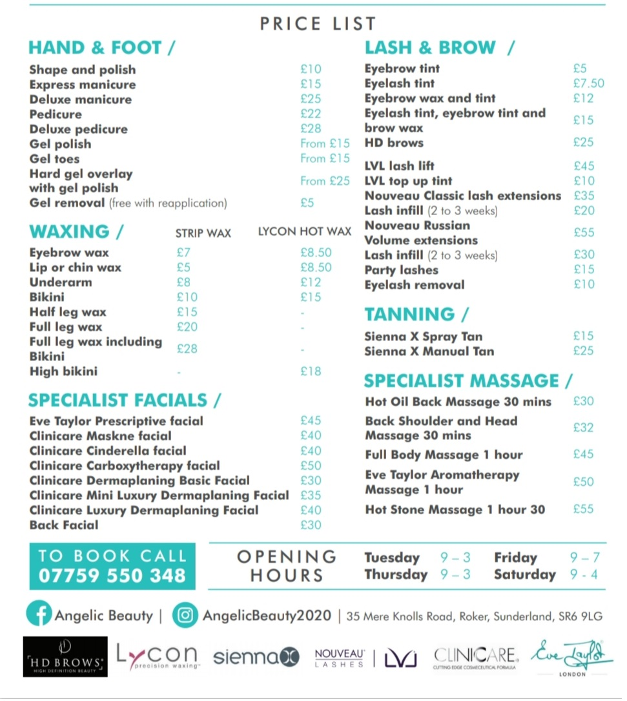

<html>
<head>
<meta name="viewport" content="width=device-width, initial-scale=1">
<link rel="preconnect" href="https://fonts.googleapis.com">
<link rel="preconnect" href="https://fonts.gstatic.com" crossorigin>
<link href="https://fonts.googleapis.com/css2?family=Josefin+Sans&display=swap" rel="stylesheet">
<link rel="stylesheet" href="https://cdnjs.cloudflare.com/ajax/libs/font-awesome/4.7.0/css/font-awesome.min.css">

</head>
<body>

  <a href="#AboutUs">About Us</a>
  <a href="#Menu">Menu</a>

  <h1 class="titleMain">ANGELIC BEAUTY</h1>
  <h2 class="subtitleMain"> Heavenly treatments with a personal touch</h2>

   
   
   
   
   

  <h3 class="title">ABOUT US</h3>
   
  <h4 class="subtitle">Hello,</h4>
  
I'm Louise, owner of Angelic Beauty. A lot of my clients say I'm the best kept secret and I want to change that. 
     
    I pride myself on making people feel at ease. It can be daunting coming into a new salon for the first time but 
     
    once you've experienced my treatments, I'm sure I will not only become your Beauty Therapist of choice but also 
     
    your friend.
     
    
Hope to meet you soon
       
      Louise x
    

     
     

    
Find Us
 &nbsp&nbsp&nbsp&nbsp&nbsp&nbsp&nbsp&nbsp&nbsp&nbsp&nbsp&nbsp&nbsp&nbsp&nbsp&nbsp&nbsp&nbsp&nbsp&nbsp&nbsp&nbsp&nbsp&nbsp&nbsp&nbsp&nbsp&nbsp&nbsp&nbsp&nbsp&nbsp&nbsp&nbsp&nbsp&nbsp&nbsp&nbsp&nbsp&nbsp&nbsp&nbsp&nbsp&nbsp&nbsp&nbsp&nbsp&nbsp&nbsp&nbsp&nbsp&nbsp&nbsp&nbsp&nbsp&nbsp&nbsp&nbsp&nbsp&nbsp&nbsp&nbsp&nbsp&nbsp&nbsp&nbsp&nbsp&nbsp&nbsp&nbsp&nbsp&nbsp&nbsp&nbsp&nbsp&nbsp&nbsp&nbsp&nbsp&nbsp&nbsp&nbsp&nbsp&nbsp&nbsp&nbsp&nbsp&nbsp&nbsp&nbsp&nbsp&nbsp&nbsp&nbsp&nbsp&nbsp&nbsp&nbsp&nbsp&nbsp&nbsp&nbsp&nbsp&nbsp&nbsp&nbsp&nbsp&nbsp&nbsp&nbsp&nbsp&nbsp&nbsp&nbsp&nbsp&nbsp&nbsp&nbsp&nbsp&nbsp&nbsp&nbsp&nbsp&nbsp&nbsp&nbsp&nbsp&nbsp&nbsp&nbsp&nbsp&nbsp&nbsp&nbsp&nbsp&nbsp&nbsp&nbsp&nbsp&nbsp&nbsp&nbsp&nbsp&nbsp&nbsp&nbsp&nbsp&nbsp
Contact Us

     
    <iframe src="https://www.google.com/maps/embed?pb=!1m18!1m12!1m3!1d2292.698648664158!2d-1.3754983842670006!3d54.92576006293772!2m3!1f0!2f0!3f0!3m2!1i1024!2i768!4f13.1!3m3!1m2!1s0x487e6669f43ca9ab%3A0x588964aa5a2136f4!2s35%20Mere%20Knolls%20Rd%2C%20Roker%2C%20Sunderland%20SR6%209LG!5e0!3m2!1sen!2suk!4v1626106107593!5m2!1sen!2suk" width="300" height="300" style="border:0;" allowfullscreen="" loading="lazy" class="Map"></iframe> &nbsp&nbsp&nbsp&nbsp&nbsp&nbsp&nbsp&nbsp&nbsp&nbsp&nbsp&nbsp&nbsp&nbsp&nbsp&nbsp&nbsp&nbsp&nbsp&nbsp&nbsp&nbsp&nbsp&nbsp&nbsp&nbsp&nbsp&nbsp&nbsp&nbsp&nbsp&nbsp&nbsp&nbsp&nbsp&nbsp&nbsp&nbsp&nbsp&nbsp&nbsp&nbsp&nbsp&nbsp&nbsp&nbsp&nbsp&nbsp&nbsp&nbsp&nbsp&nbsp&nbsp&nbsp&nbsp
Follow and Contact Us on Social Media or call at 07759 530 348
 
    
     
    
Opening Hours
       
       
      Sunday - Tuesday: &nbsp&nbsp Closed
       
       
      Wednesday: &nbsp 09:15 - 15:00
       
       
      Thursday:   &nbsp&nbsp&nbsp&nbsp&nbsp&nbsp09:15 - 15:00
       
       
      Friday:     &nbsp&nbsp&nbsp&nbsp&nbsp&nbsp&nbsp&nbsp&nbsp&nbsp09:15 - 19:00
       
       
      Saturday:     &nbsp&nbsp&nbsp&nbsp&nbsp&nbsp09:00 - 16:00
    

    

     
     
     
     
     
     
     
     

    <h5 class="title" id="Menu">Menu</h5>
    
Check out our available services below and click the button to book your appointment now

     
     
    <a href="https://bookings.gettimely.com/angelicbeauty2/book?uri=https%3A%2F%2Fbook.gettimely.com%2FBooking%2FService%3Fobg%3D771bdca0-4184-4c34-ae28-8360085293da" class="buttonMenu">Book Now</a>
     
     
    

    

    &times;
    
    

    

    

</body>
</html>
